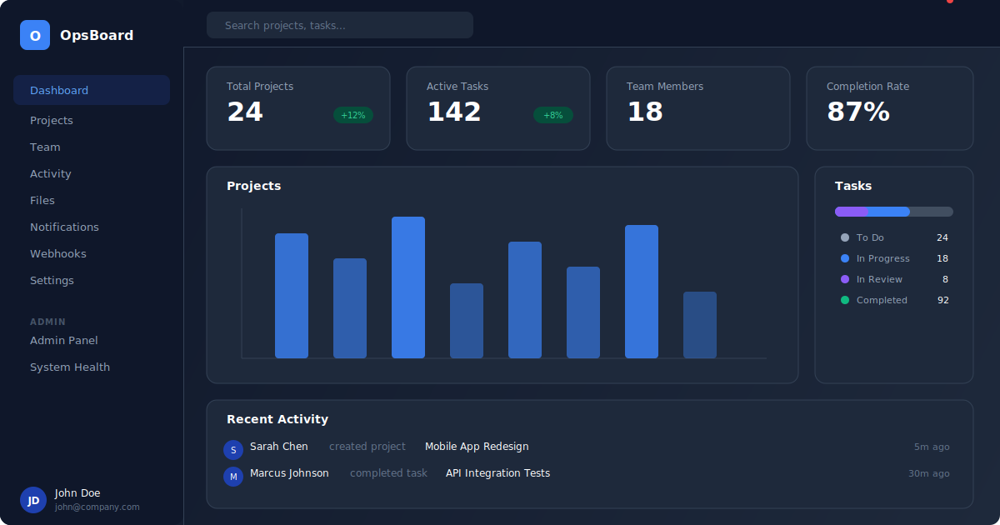
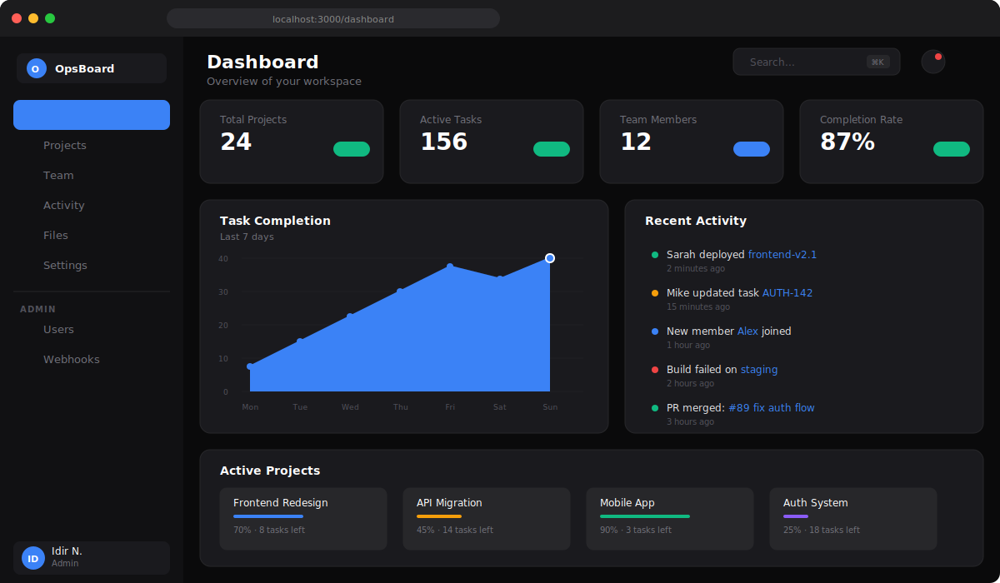
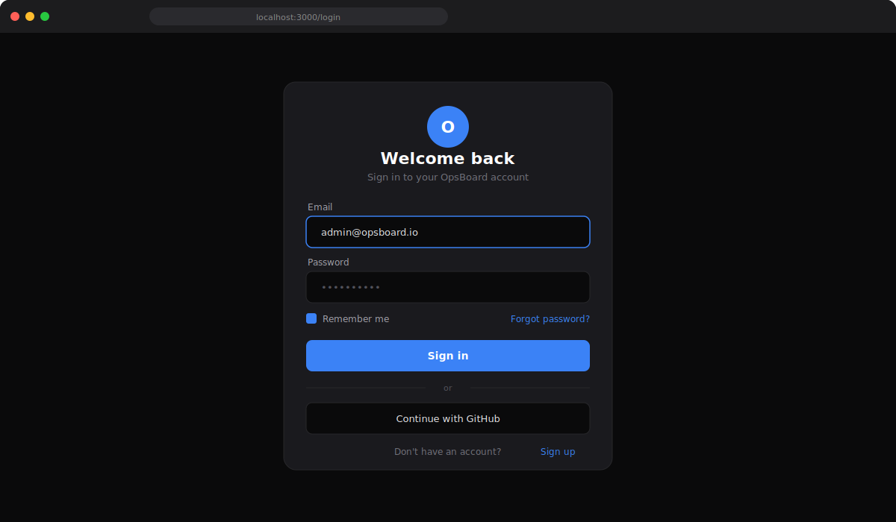
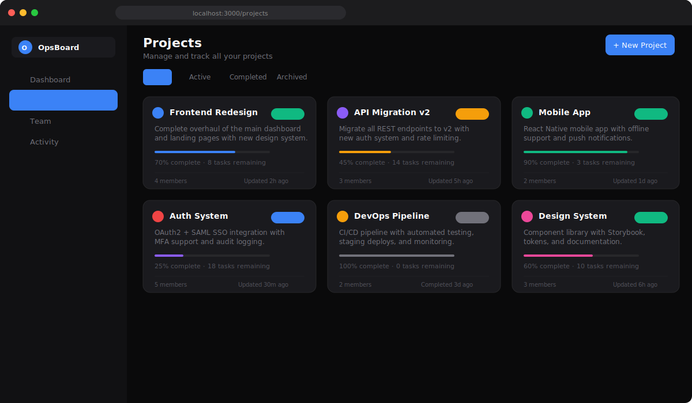

# OpsBoard

Full-stack operations management platform built with Next.js 14, TypeScript, and PostgreSQL.



### Dashboard


### Authentication


### Projects


## Features

- **Authentication** — Email/password + GitHub OAuth with JWT sessions
- **Role-Based Access** — Admin, manager, member, and viewer roles with granular permissions
- **Dashboard** — Real-time stats, activity feed, project overview, and task distribution
- **Projects** — Full CRUD with status tracking, priority levels, and progress monitoring
- **Team Management** — Invite members, assign roles, track online status
- **Activity Logs** — Comprehensive audit trail with filtering
- **Notifications** — In-app notification center with read/unread tracking
- **File Uploads** — S3-compatible file management system
- **Webhooks** — Configure event-driven integrations with signed payloads
- **Admin Panel** — System health monitoring, user management, audit logs
- **Settings** — Profile, security (2FA), preferences, notification controls

## Tech Stack

- **Framework:** Next.js 14 (App Router)
- **Language:** TypeScript
- **Styling:** Tailwind CSS
- **Database:** PostgreSQL with Drizzle ORM
- **Auth:** NextAuth.js (JWT strategy)
- **Validation:** Zod
- **File Upload:** UploadThing
- **Charts:** Recharts

## Getting Started

```bash
# Clone and install
git clone https://github.com/idirdev/opsboard.git
cd opsboard
npm install

# Setup database
cp .env.example .env
# Edit .env with your PostgreSQL connection string
npm run db:push

# Run development server
npm run dev
```

## Project Structure

```
src/
├── app/
│   ├── (auth)/          # Login, register pages
│   ├── (dashboard)/     # Protected dashboard routes
│   │   ├── dashboard/   # Main dashboard
│   │   ├── projects/    # Project management
│   │   ├── team/        # Team management
│   │   ├── settings/    # User settings
│   │   └── admin/       # Admin panel
│   └── api/             # API routes
│       ├── auth/        # Auth endpoints
│       ├── projects/    # Projects CRUD
│       └── webhooks/    # Webhook management
├── components/          # React components
│   └── dashboard/       # Dashboard widgets
└── lib/
    ├── db/              # Database schema & connection
    ├── auth.ts          # NextAuth configuration
    ├── utils.ts         # Utility functions
    └── validations.ts   # Zod schemas
```

## License

MIT

## Deployment

Build with `npm run build` and deploy the `.next` standalone output.

---

## 🇫🇷 Documentation en français

### Description
OpsBoard est une plateforme de gestion des opérations full-stack construite avec Next.js 14, TypeScript et PostgreSQL. Elle centralise la gestion des incidents, des déploiements, des métriques systèmes et des équipes dans un tableau de bord unifié. Un outil conçu pour les équipes DevOps souhaitant une visibilité complète sur leurs opérations.

### Installation
```bash
git clone https://github.com/idirdev/opsboard.git
cd opsboard
npm install
cp .env.example .env
# Configurez la base de données dans .env
npm run dev
```

### Utilisation
Accédez à l'application dans votre navigateur après le démarrage du serveur de développement. Consultez la documentation en anglais ci-dessus pour la configuration de la base de données, l'authentification et les fonctionnalités complètes.
